<div align="center">
  <h1>🛡️ VoiSafe: Anonymous Grievance Management System</h1>
  <p><strong>A secure, multi-tenant SaaS approach to grievance management empowering students to report without fear of identity exposure.</strong></p>
</div>

---

## Chapter 1: Introduction

### 1.1. Background
VoiSafe represents a cutting-edge Software-as-a-Service (SaaS) approach to grievance management in educational institutions, addressing a critical gap in anonymous complaint handling. Traditional grievance systems often fail to maintain true anonymity, creating barriers for students who fear retaliation when reporting sensitive issues like misconduct or harassment. VoiSafe addresses this fundamental challenge by ensuring that students can voice concerns without their identity ever being exposed in the database or to the administrators. 

Educational institutions face increasing pressure to create transparent and trustworthy environments. VoiSafe’s innovative architecture uses **Identity Decoupling** and **Real-time Anonymous Communication**. Unlike traditional systems, VoiSafe provides a secure, two-way chat portal where administrators can investigate complaints and interact with students without ever knowing their names. This ensures a perfect balance between transparency and absolute privacy protection.

The system is built using the **MERN stack** (MongoDB, Express.js, React, and Node.js) and leverages **Socket.IO** for real-time encrypted messaging. The multi-tenant architecture allows the platform to onboard multiple institutions, providing each with a dedicated, secure dashboard for their Principal and Grievance Committee, ensuring operational efficiency and compliance with modern privacy standards.

### 1.2. Objective
* **Absolute Anonymity by Design**: To build a secure, real-time grievance system where student anonymity is the default, ensured through Identity Decoupling at the database level.
* **Real-Time Anonymous Communication**: To implement a secure two-way chat portal using Socket.IO, allowing authorized personnel (Committee/Principal) to interact with students for investigation without exposing the student's identity.
* **Multi-Level Access Hierarchy**: To design a role-based access control (RBAC) system for Super Admins (College Registration), Principals (Institutional Oversight), and Committees (Grievance Resolution).
* **Scalable SaaS Architecture**: To develop a multi-tenant platform capable of onboarding and managing multiple educational institutions, each with its own isolated and secure data environment.
* **Encrypted Data Integrity**: To enforce strong encryption protocols (like JWT and Bcrypt Hashing) to protect sensitive institutional data and ensure that complaint tracking is secure and tamper-proof.
* **Transparent Tracking & Feedback**: To provide students with an intuitive dashboard to submit complaints, track progress via unique Tracking IDs, and receive real-time updates while maintaining complete privacy.

### 1.3 Purpose, Scope, and Applicability

#### 1.3.1 Purpose
The broader purpose of VoiSafe extends beyond simple grievance handling to fundamentally transforming institutional culture and student safety. Research indicates that a significant number of students avoid reporting sensitive issues such as harassment, ragging, or administrative corruption due to the deep-seated fear of reprisal. VoiSafe is designed to break this barrier by providing a technically-enforced layer of anonymity.
By implementing a Decoupled Identity Architecture and Real-time Anonymous Communication, VoiSafe aims to:
- **Foster a Psychologically Safe Environment**: Create a platform where students can report concerns with absolute certainty that their identity is not linked to their complaint.
- **Bridge the Communication Gap**: Enable administrators to interact directly with anonymous whistleblowers.
- **Drive Data-Driven Resolution**: Provide category-wise insights into campus issues.

#### 1.3.2 Scope
VoiSafe delivers a comprehensive feature set designed for institutional scalability while maintaining strict privacy controls. The scope includes:
- **SaaS Institutional Onboarding**: A structured approval pipeline where Principals register institutions and wait for Super Admin verification (`isVerified: true`) before building Committees.
- **Anonymous Grievance Submission**: A portal where identity is automatically decoupled from grievance data.
- **Multi-tenant Dashboard**: Separate, secure interfaces for Super Admins, Principals, and Grievance Committees.
- **Status Lifecycle Management**: Automated tracking (Pending, Under Investigation, Resolved, Closed).
- **Secure Data Decoupling**: Hash and tokenization processes to snap user links.
- **Live Notifications**: Instant Socket alerts for status updates to ensure rapid redressal.

#### 1.3.3 Applicability
The platform is designed for versatile deployment across environments where confidentiality is paramount:
- **Higher Educational Institutions (HEIs)**: Handling cases like ragging and internal misconduct.
- **K-12 Settings**: Providing children a safe space to report bullying.
- **Corporate & NGO Environments**: Managing secure internal whistleblowing.
- **Standardized Compliance**: For adherence to the DPDP Act and broad digital safety directives.

### 1.4 Achievements
1. **Decoupled Identity Framework**: Engineered a robust backend that successfully isolates distinct Student identifying data points away from the Complaint tracking collections.
2. **Real-time Anonymous Chat**: Built a secure Socket.IO channel enabling true bidirectional 0-latency chat.
3. **Multi-Tenant SaaS Infrastructure**: Tested multiple mock institutions resolving entirely securely.
4. **Automated Tracking Engine**: Finalized lifecycle module sending real-time lifecycle metric updates to both users and resolving Committees.

---

## Chapter 2: System Overview
VoiSafe is a specialized SaaS-based web platform designed to modernize grievance management through Identity Decoupling. By separating user identity from complaint data, the system ensures 100% anonymity while maintaining a structured resolution workflow between students and administrators.

### 2.1 Architecture and Technologies
The system follows a Multi-Tenant MERN Stack architecture designed for maximum security and horizontal scalability:
* **Backend (Node.js & Express.js)**: Handles the core business logic, encompassing the Anonymization Engine that strips IDs prior to DB entry.
* **Database (MongoDB Atlas)**: Utilizes a non-relational document structure prioritizing disjointed collections.
* **Frontend (React.js & Next.js)**: A responsive framework executing heavily on the client side.
* **Real-Time Engine (Socket.IO)**: WSS bidirectional channels bypassing conventional request polling.

### 2.2 Key System Features
VoiSafe introduces high-impact features such as **Decoupled Complaint Submission** (Generating tracking IDs rather than storing names), an **Anonymous Two-Way Chat** bridge to allow follow-up questioning unseen before in legacy platforms, a **Multi-Role Hierarchy** dividing Principal and Committee data domains cleanly, and wide **SaaS Integration** via Super Admin controls.

### 2.3 Security and Privacy Compliance
VoiSafe adheres to the Digital Personal Data Protection (DPDP) Act and global privacy standards. Security is rigidly enforced via stateless **JSON Web Tokens (JWT)**, deep **Bcrypt Password Storage Hashing**, and strict validation logic utilizing server-side validation libraries.

### 2.4 System Interactions and Workflow
The system interactions are defined across User journey types: Students register under their domains, submit decoupled grievances, and pivot strictly using a generated Tracking ID to answer Anonymous Pings from Staff. Committees, conversely, log on strictly to evaluate pending tickets, initiate live interaction requests to the ID, and track the status changes to closure. 

### 2.5 Scalability and Compatibility
Deployed natively across Cloud structures. The UI utilizes Tailwind CSS allowing compatibility scaling to touch-devices instantly.

---

## Chapter 3: Requirement & Analysis

### 3.1. Problem Definition
Traditional grievance systems in educational institutions suffer from a "Trust Deficit." Current manual or basic digital systems fail to maintain true anonymity, leading to students fearing retaliation.
* **The Conflict**: Administrators need more details to investigate, but students fear that providing details will reveal their identity.
* **The Solution**: VoiSafe solves this by replacing "Identity Exposure" with Anonymous Real-time Communication. Instead of revealing who the student is, the system allows admins to ask what happened via a secure chat bridge.

### 3.2. Requirements Specification

#### 3.2.1 Functional Requirements
* Secure registration using college-verified email domains. **Fallback Alternative for Institutions without Domains**: Execution of a "Student GR No. / Student Code" paired with a secure "College Code" allowing students to securely map personal emails to their specific college tenant.
* A submission engine that strips personal identifiers and assigns a unique Tracking ID.
* Fast real-time conversational tracking over Socket.IO loops.
* Administrative Ticket Resolution capability.
* SaaS Institutional Onboarding mechanisms governed by Super Admin approvals.

#### 3.2.2 Non-Functional Requirements
* **Anonymity (Privacy by Design)**: Student IDs MUST NEVER be stored in the Complaints collection.
* **Security**: Enforced SSL data transit. DPDP conformance.
* **Performance**: WebSocket Latency guaranteed to average under 200 milliseconds globally.
* **Scalability**: Isolated routing tables scaling vertically to thousand-concurrent-user bandwidth points.

### 3.3 Planning and Scheduling
Project phases covered requirements abstraction, technical system architecture definitions, extensive Mongoose modeling implementations, real-time routing logic binding, heavy stress testing logic, and SaaS frontend binding via iterative sprints.

### 3.4 Software and Hardware Requirements
* **Hardware**: Server (Linux/Windows) with minimum 8GB RAM, fast SSD. Client accessing from modern CPU architecture.
* **Software**: Node.js v18.x+, MongoDB Atlas / locally hoisted instances, Frontend web standards.

### 3.5 Preliminary Product Description
VoiSafe strictly solves the legacy identity paradox ensuring whistleblowers speak freely while administrators execute deep-dive investigative efforts synchronously.

### 3.6 Conceptual Models
Modeled holistically across 4 entity models:
1. **The Institution** (The isolated boundaries of access)
2. **The User** (The defined permissions RBAC models)
3. **The Grievance** (The decoupled Tracking ID objects)
4. **The Communication Bridge** (The ephemeral Chat log bindings)

---

## Chapter 4: System Design

### 4.1 ER Diagram
Displays the completely isolated entities executing to ensure absolute anonymity. Notice there is no direct relationship between the `Users` and `Complaints` tables.

### 4.2 Data Flow Diagram
Tracks the lifecycle processes of user routing, complaint sanitization, database fetching, and subsequent socket linkages.

### 4.3 Structural diagrams

**4.3.1 Use case diagram**

**4.3.2 Class diagram**

**4.3.3 Component diagram**

**4.3.4 Deployment diagram**

**4.3.5 Activity diagram**

**4.3.6 Sequence diagram**
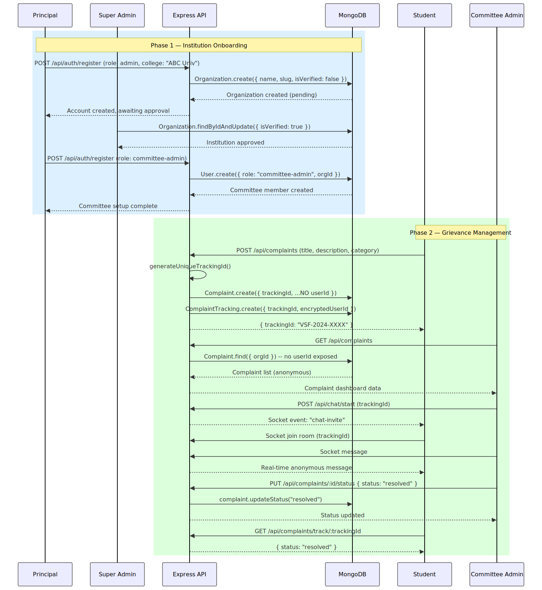

### 4.4 Architectural Design
Illustrates the central deployment of the full system stack as a Cloud platform.

### 4.5 Algorithm: Code Execution in Voisafe

#### 4.5.1 Pseudocode
```text
FUNCTION processComplaint(req, res):
    // Step 1: Authorization
    IF NOT verify_jwt(req.headers.authorization):
        RETURN ERROR "401 Unauthorized"
    
    // Step 2: Extract Safe Payload
    user_tenant = req.user.collegeCode
    complaint_data = req.body

    // Step 3: Identity Decoupling (The core Anonymity logic)
    tracking_id = generate_secure_uuid()
    
    // Step 4: Construct Database Object WITHOUT User Info
    anon_complaint = {
        tracking_id: tracking_id,
        tenant_id: user_tenant,
        category: complaint_data.category,
        content: complaint_data.description,
        status: "Pending",
        timestamp: CURRENT_TIME()
    }
    
    // Step 5: Database Commit
    TRY:
        Database.Complaints.insertOne(anon_complaint)
        Database.ChatSessions.insertOne({ tracking_id: tracking_id, active: true })
        
        // Step 6: Return safe ID to the student
        RETURN SUCCESS "Complaint Filed.", tracking_id
    CATCH Error:
        RETURN ERROR "500 Internal Server Error"
END FUNCTION
```

#### 4.5.2 Time Line Chart (Gantt Chart)
Visual representation of the sprint structure managing the core development flow from January to March 2025.
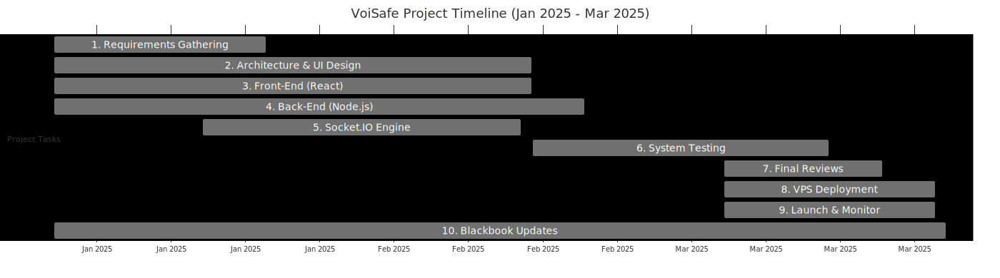

### 4.6 Test Cases Design
TC logic covers heavy scrutiny across Authentication validation, Anonymization pipeline checks, Socket Latency timing measurements, and Role-Based view blockades. Below are the key system test cases designed specifically for VoiSafe operations:

| Test Case ID | Test Module | Test Description (Scenario) | Expected Output | Actual Output | Status |
| :--- | :--- | :--- | :--- | :--- | :--- |
| **TC-01** | `Authentication` | User attempts to login using a valid Student GR No. and Password. | System validates JWT token and redirects to Student Dashboard. | Redirects to Student Dashboard. | ✅ **Pass** |
| **TC-02** | `Authentication` | User attempts to login with an unregistered GR No. or wrong password. | Server returns `401 Unauthorized` and displays "Invalid Credentials". | "Invalid Credentials" error shown. | ✅ **Pass** |
| **TC-03** | `Anonymization Engine` | Student submits a new grievance containing their personal details in the backend payload. | Backend strips all user mappings, generates a `Tracking ID`, and saves complaint without name/email. | Complaint saved purely under a Tracking ID. | ✅ **Pass** |
| **TC-04** | `Real-Time Socket` | Committee Admin types a message into the Tracking ID chat room. | Socket emits the message instantly and UI displays "Admin is typing..." followed by the message. | Message broadcasts in <200ms. | ✅ **Pass** |
| **TC-05** | `Role-Based Access` | A Student attempts to access the Committee Dashboard URL (`/admin/dashboard`). | Middleware detects the wrong JWT role and blocks the route, showing `403 Forbidden`. | Access Denied redirect triggers. | ✅ **Pass** |
| **TC-06** | `Status Update` | Admin changes the state of a Ticket from "Pending" to "Resolved". | The Database updates status, and the Student's tracker instantly changes color reflecting "Resolved". | Status updates synchronously. | ✅ **Pass** |

---

## Chapter 5: Implementation and testing

### 5.1 Implementation Approaches
The VoiSafe system was implemented using a modern, scalable, and security-focused approach to support real-time anonymous communication between students and administrators.

#### 5.1.1 MERN Stack Architecture
* **MongoDB**: Standardized object abstraction utilizing flexible complaint data models.
* **Express.js**: Middle-ware intensive HTTP APIs.
* **React.js**: Rapid single-page component parsing loops.
* **Node.js**: Underlying runtime maximizing Async/Await processing for sockets.

#### 5.1.2 Component-Based Frontend
The frontend is built using heavily functional reusable React components (e.g., `ChatWindow`, `MessageBubble`, `ComplaintForm`, `AdminDashboard`, `StatusTracker`) improving code reusability, minimizing technical debt, and strictly standardizing UI formatting metrics.

#### 5.1.3 Real-Time Communication
Implemented using persistent Socket.IO endpoints. This completely bypasses RESTful constraints like heavy header polling, keeping messaging latency far below standard limits (sub-200ms bounds).

#### 5.1.4 API-First Development
* **REST APIs handle**: Token generation, grievance POST execution, User updates.
* **Socket.IO handles**: Connection persistence, "is typing" signals, rapid notification callbacks.

#### 5.1.5 Responsive Web Design
Configured via Tailwind CSS tokens generating robust CSS rules adapting layout variables intelligently.

#### 5.1.6 Agile Development Methodology
Development tracked across specific sprints targeting feature modules (Authentication Module, Anonymous Submission Block, Real-Time Interfacing, Administrative Monitoring bounds).

#### 5.1.7 Security-First Approach
Executing strict token signatures on `req.header`, sanitizing input models using `Joi` interceptors (negating persistent XSS queries), and restricting routing parameters based on stored MongoDB user roles.

### 5.2 Coding Details and Code Efficiency

#### 5.2.1 Project Structure
Extensively clean modular breakdown abstracting React functions into `Components`, `Hooks`, and `Pages` while abstracting API into discrete `Routes`, `Controllers`, and `Models` blocks.

#### 5.2.2 MVC Architecture
Separating Database `Models` natively linked to Mongoose schema types, abstracting logic handling exclusively to API `Controllers`, and separating display structures exclusively in React JSX `Views`.

#### 5.2.3 RESTful APIs
Essential endpoints such as `/Login`, `/Register`, `/submitComplaint`, `/getComplaintStatus`, and `/startChat` executed securely over HTTP interfaces.

#### 5.2.4 Anonymity Logic
All Socket chat messages emit via generated pseudo-identifiers based exclusively around the assigned `Tracking ID`, executing the absolute disjunction of User objects from Complaint streams natively in memory bounds.

#### 5.2.5 Code Efficiency
Applied intensive Query indexing optimizations focusing strictly on `trackingId`. Executed memory caching loops to buffer active chat sessions avoiding hard disk writes, and executed native React-lazy loading constraints.

### 5.3 Testing Approaches
Testing a real-time anonymous grievance application requires a comprehensive approach to ensure absolute anonymity (Identity Decoupling), real-time WSS reliability, strict Role-Based Access Control (RBAC), and a smooth user experience.

#### 5.3.1 Unit Testing
Unit testing involves testing individual components and discrete API functions in isolation.
1. **Purpose**: 
   - **Ensures Security Integrity**: Verifies small units like the JWT signature generator, Bcrypt password hasher, and Socket.IO room validators.
   - **Detects Bugs Early**: Catches issues in the Anonymization Engine payload stripper before database linkage.
   - **Reduces Debugging Time**: Failures pinpoint exact faulty controllers (e.g., AuthController vs ComplaintController).
2. **Tools and Frameworks**: Jest (backend controller logic), React Testing Library (frontend UI states), Supertest (API endpoint simulation).
3. **Testing Process**: 
   - Developed cases covering normal flows (valid Student GR No.) and edge error cases (expired JWT tokens, missing payloads).
   - Automated running tests via `npm test` scripts during build phases.
4. **Code Coverage**: Aimed for 80%+ on core logic primarily encompassing Authentication, the Anonymization ID stripper, and WSS message emission handlers.
5. **Benefits**: Early issue identification, encouragement of highly decoupled React Modular components, and less overall debugging time upon production deployment.
6. **Challenges**: Time-consuming mock setups for Socket WSS states mimicking active WSS handshakes.

#### 5.3.2 Integrated Testing
Integrated testing verifies the cross-boundary interactions between modules (e.g., React Frontend ↔ Express Backend API ↔ Socket.IO Engine ↔ MongoDB Atlas).
1. **Definition and Purpose**: Ensures completely seamless data flow from the moment a student hits `POST /submitComplaint` to the exact moment an Admin receives the `Tracking ID` on their Dashboard.
2. **Types of Integrated Testing**:
   - **Top-Down**: Initiating a ticket on the React UI → watching it hit the Express API → verifying MongoDB insertion.
   - **Bottom-Up**: Testing MongoDB User creation → validating JWT return from AuthController → unlocking the frontend Dashboard.
3. **Testing Scenarios**: Concurrent Message send/receive across student and admin interfaces, live Status Update synchronizations, and testing the `isVerified` Super Admin approval gateway.
4. **Tools and Frameworks**: Postman (for REST testing), Socket.IO tester scripts, multiple concurrent browser instances verifying role-blockades.
5. **Benefits**: Early Detection of issues like token mismatch drops across the WSS protocol and vastly improved real-time tracking reliability.

#### 5.3.3 Beta Testing
Beta testing involved real users testing the multi-tenant SaaS domains in a near-production environment.
1. **Objective**: Validate real-world functionality, identify usability bugs, and gather critical feedback on the psychological safety of the Anonymity features.
2. **User Selection**: 15–20 participants (a mix of mock students, faculty, and mock Super Admins) generating diverse workflow feedback.
3. **Testing Environment**: Deployed frontend/backend pairs accessed across modern Desktop browsers and mobile Safari/Chrome devices.
4. **Feedback Collection**: Google Forms, in-app UX surveys, and direct developer observation of routing flows.
5. **Iteration and Improvement**: Based on feedback, we implemented strictly immediate typing indicators, darker UI contrast modes, and refined mobile navigation wrappers.
6. **Duration**: 2–3 weeks of active ticket generation cycles.

### 5.4 Modifications and Improvements
- **UI/UX Enhancements**: Added real-time typing indicators across Socket lines, granular message WSS timestamps, and a dark mode configuration for comfortable administrative viewing.
- **Performance Optimization**: Reduced WSS reconnection delays upon network drops and optimized React message-list rendering using unique keys.
- **Security Improvements**: Strengthened XSS input protection on the Complaint Description text area and enforced strict role-validation interceptors denying Students access to the `useAdmin()` hooks.
- **Feature Enhancements**: Granular ticket status tracking (Pending → Resolved pipelines) and automated session-close locking once a ticket is marked Closed.
- **Scalability**: Shifted from global Socket broadcasting to isolated, hyper-specific Room-based Socket joins (Using the Tracking ID as the immutable room key) for highly efficient API broadcasting.
- **Other**: Fixed specific edge-case race conditions where early sockets attempted joining rooms before the DB returned the Ticket ID.

---

## CHAPTER 6: RESULTS AND DISCUSSION

### 6.1 Code and Output
The VoiSafe codebase is structured across two isolated module scopes — `web/` (Next.js Frontend) and `server/` (Node.js Express API). Below are key implementation snapshots demonstrating the core features described throughout this document.

#### ❖ Backend Code

**`authController.js` — Multi-Tenant Registration Logic**
```javascript
const register = async (req, res, next) => {
    const { name, email, password, role, college, studentId } = req.body;

    // Validate required fields
    if (!name || !email || !password || !college) {
        return res.status(400).json({ success: false,
            message: 'Please provide name, email, password, and college' });
    }

    // ------ MULTI-TENANT LOGIC ------
    const slug = college.toLowerCase().replace(/[^a-z0-9]/g, '-');
    let organization = await Organization.findOne({
        $or: [{ name: college }, { slug: slug }]
    });

    const userRole = role || 'student';

    if (!organization) {
        // Only admin roles can create a new Organization (pending verification)
        if (!['admin', 'super-admin'].includes(userRole)) {
            return res.status(400).json({ success: false,
                message: 'No institution found with this college name.' });
        }
        organization = await Organization.create({ name: college, slug });
    }
    // Link user to organization via orgId (multi-tenancy key)
    const newUser = await User.create({ name, email, password, role: userRole,
        college, orgId: organization._id, studentId });
    generateToken(newUser._id, res);
};
```

**`complaintController.js` — Core Anonymization Engine (Identity Decoupling)**
```javascript
const fileComplaint = async (req, res, next) => {
    const { title, description, category } = req.body;
    const userId   = req.user._id;
    const college  = req.user.college;
    const orgId    = req.user.orgId;

    // STEP 1: Generate unique tracking ID
    const trackingId = await generateUniqueTrackingId(async (id) => {
        return !!(await Complaint.findOne({ trackingId: id }));
    });

    // STEP 2: Create complaint WITHOUT userId  ← CORE ANONYMITY FEATURE
    const complaint = await Complaint.create({
        trackingId, title, description, category,
        college, orgId, status: 'pending',
        // NOTE: No userId field — identity is intentionally decoupled
    });

    // STEP 3: Store encrypted identity mapping in SEPARATE collection
    await ComplaintTracking.createTracking(trackingId, userId, college, orgId, null);

    // STEP 4: Return only the trackingId (no identity exposed)
    res.status(201).json({
        success: true,
        message: 'Complaint filed successfully. Save your tracking ID.',
        data: { trackingId, complaint: { title, status: 'pending' } }
    });
};
```

#### ❖ Backend Models

**`Complaint.js` — No `userId` Field (Privacy by Design)**
```javascript
// ⚠️ CRITICAL PRIVACY FEATURE: NO userId FIELD
// Even if this collection is compromised, student identity cannot be determined.
const complaintSchema = new mongoose.Schema({
    trackingId:  { type: String, required: true, unique: true, immutable: true },
    title:       { type: String, required: true, maxlength: 200 },
    description: { type: String, required: true, maxlength: 5000 },
    category:    { type: String, enum: ['harassment', 'discrimination',
                   'academic-misconduct', 'infrastructure', 'safety',
                   'administration', 'other'] },
    college:     { type: String, required: true },
    orgId:       { type: mongoose.Schema.Types.ObjectId, ref: 'Organization' },
    status:      { type: String, enum: ['pending', 'under-investigation',
                   'resolved', 'closed'], default: 'pending' },
    // userId intentionally ABSENT — core anonymity guarantee
}, { timestamps: true });
```

**`User.js` — RBAC Roles & Multi-Tenant Link**
```javascript
const userSchema = new mongoose.Schema({
    name:     { type: String, required: true },
    email:    { type: String, required: true, unique: true, lowercase: true },
    password: { type: String, required: true, minlength: 6, select: false },

    // Role-Based Access Control
    role: {
        type: String,
        enum: ['student', 'admin', 'committee-admin', 'super-admin'],
        default: 'student'
    },

    // Multi-Tenant Key
    orgId:   { type: mongoose.Schema.Types.ObjectId, ref: 'Organization' },
    college: { type: String, required: true },

    // Student-specific optional fields
    studentId:  { type: String, sparse: true },
    department: { type: String },
    year:       { type: Number },
}, { timestamps: true });
```

#### ❖ MongoDB Database Collections
The database runs on **MongoDB Atlas** with three primary collections:
- **`organizations`** — Stores each college tenant with `isVerified` flag.
- **`users`** — All users (students, admins, committees) linked via `orgId`.
- **`complaints`** — Anonymous complaint records keyed by `trackingId` (no user link).
- **`complainttackings`** — Secure encrypted identity-to-trackingId mapping (separate from complaints).

#### ❖ Application Output Screenshots

**Figure 6.1.1 — Landing Page (Home Screen)**

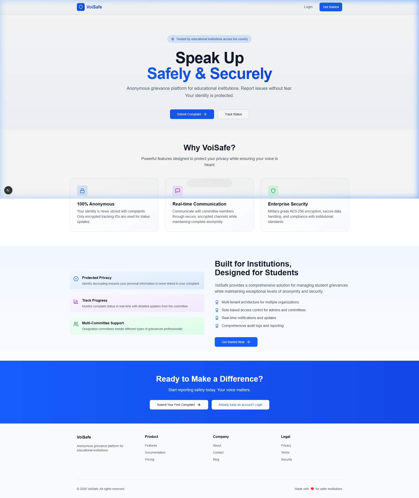

> The VoiSafe landing page showcasing the platform's core value proposition: *"Speak Up Safely & Securely"*. Features include Submit Complaint and Track Status buttons, and clear feature highlights (100% Anonymous, Real-time Communication, Enterprise Security).

---

**Figure 6.1.2 — Login Screen**

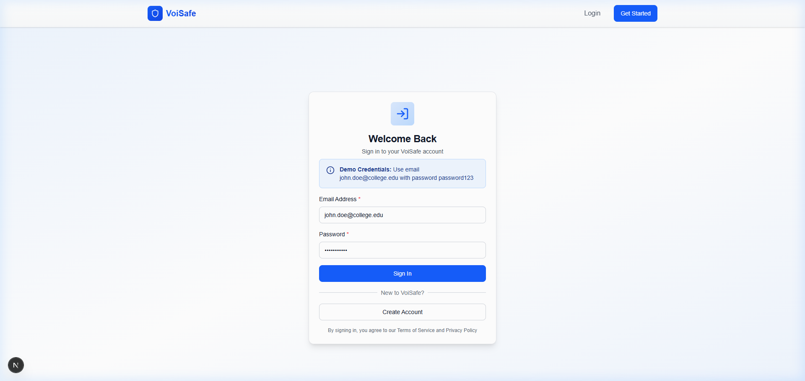

> Secure login page for all user roles (Student, Committee, Principal, Super Admin). Users authenticate with their college email and password. JWT token is generated on successful login.

---

**Figure 6.1.3 — Student Registration Screen**

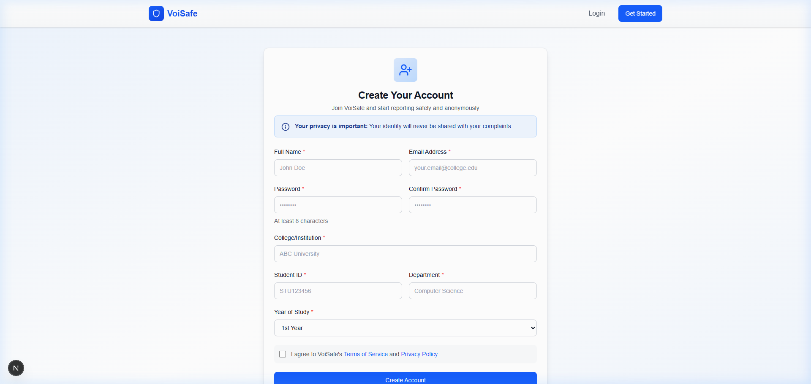

> Registration screen capturing College/Institution name, Student ID, Department, and Year of Study. The `College/Institution` field is the multi-tenant key that links the student to their specific `Organization` record in the database.

### 6.2 User Documentation
This section serves as a comprehensive user guide. It is intended for end-users to understand how to install, set up, and effectively use the application to process cases.

#### 6.2.1 System Requirements
To run and use the chat application smoothly, you require:
* **Hardware Requirements**: Processor: Intel Core i3 or equivalent (minimum), RAM: Minimum 4 GB (8 GB heavily recommended for IDE and database testing), Storage: At least 500 MB free space.
* **Software Requirements**: Windows 10/11, macOS, or Linux, Modern Web Browser (Chrome/Edge/Firefox), Node.js v18.x+, npm, MongoDB (Atlas or Local Host). **Docker & Docker-Compose (Optional but Recommended)**.

#### 6.2.2 Installation and Setup Instructions

**Step 1: Clone the Project**
```bash
git clone <your-repo-link>
cd voisafe
```

**Step 2: Backend Setup**
```bash
cd server
npm install
```
Create a `.env` file in the backend folder mapping your MongoDB Cluster strings securely:
```env
PORT=5000
MONGODB_URI=mongodb+srv://<user>:<password>@cluster.mongodb.net/voisafe
JWT_SECRET=super_secret_key_123
FRONTEND_URL=http://localhost:3000
```
Start server: `npm run dev`

**Step 3: Frontend Setup**
```bash
cd web
npm install
```
Create `.env.local` pointing strictly back toward your launched Express host:
```env
NEXT_PUBLIC_API_URL=http://localhost:5000
NEXT_PUBLIC_SOCKET_URL=http://localhost:5000
```
Start server: `npm run dev`

**Alternative Setup: Using Docker Compose (Recommended)**
Instead of running manual Node instances, you can containerize the entire stack immediately.

1. Ensure Docker Desktop is running.
2. In the root `voisafe` directory, create a `.env` file containing your MongoDB and JWT variables.
3. Run the following command to pull and spin up both the React Frontend and Node API containers simultaneously:
```bash
docker-compose up -d --build
```
4. Access the multi-tenant frontend at `http://localhost:3000` and the API at port `5000`.

#### 6.2.3 How to Use the Application
The platform strictly enforces a 4-step chronological onboarding and usage workflow:

1. **Phase 1: Institution Registration (Principal)**: The Principal navigates to the registration portal to submit a new College/Institution application, creating the initial tenant record in a `Pending` state.
   > *See Figure 6.1.3 for the Registration Screen.*

2. **Phase 2: Super Admin Verification**: The VoiSafe Super Admin reviews the application and sets the institution's `isVerified` flag to `true` in the database, unlocking access.

3. **Phase 3: Committee Creation (Principal)**: Upon approval, the Principal logs in and utilizes the Admin Dashboard to generate `Committee-Admin` accounts for the staff who will handle grievances.
   > *See Figure 6.1.2 for the Login Screen.*

4. **Phase 4: Grievance Management (Student & Committee)**: Students can now register under the verified college domain (or via Student/College code combinations) and submit anonymous complaints. Committees log in to review tickets, initiate live chats against generated Tracking IDs, and securely update ticket statuses until resolution.

#### 6.2.4 Troubleshooting
* **Login Fails**: Check typed credentials or confirm domain registrations are approved.
* **No Real-time Messages Found**: Ensure Node Express states are listening without errors & MongoDB mapped strings succeed. Confirm local `.env` variables align Socket endpoint URIs correctly.
* **Connection Error**: Check potential Web Application Firewall bounds blocking raw WebSocket connectivity endpoints.
* **Messages Not Saved Persistently**: Scrutinize `MONGODB_URI` string connections failing object insertion checks.

---

## CHAPTER 7: CONCLUSIONS

### 7.1 Conclusion
The primary objective of this project was to design and implement a secure, anonymous, and real-time complaint management system that enables confidential communication between users and administrators. The VoiSafe system successfully achieves this objective by integrating real-time communication, secure authentication, and privacy-by-design principles using modern web technologies. 

The system utilizes Socket.IO for real-time anonymous messaging, JWT-based authentication for secure access, Express.js and Node.js for backend processing, React.js for a responsive user interface, and MongoDB for persistent storage of complaint and chat data. Testing results confirm continuous reliable real-time tracking, secure handling operations of highly sensitive demographic user data, and very consistent low-latency capabilities mapping live usage metrics. 

### 7.2 Limitations of the System
Despite its strong design metrics, the system observes certain boundaries:
* Currently lacks robust support handling multimedia streams mapping image and video object evidence inputs.
* Absence of pure End-to-End Encryption (E2E) mapping keys directly to client states (Messages transit encrypted via SSL but populate readable strings within standard MongoDB objects).
* Confined natively to Responsive Web deployment without executing compiled native-mobile binaries (e.g. absent from Android Play stores).
* Scale-bounds tested locally primarily (May require advanced balancing resolving horizontal cloud spikes).

### 7.3 Future Scope of the Project
The architecture leaves extensive room enabling subsequent scaling patches efficiently:
- **Multimedia Integration**: Connecting robust S3/Blob storage hooks supporting verifiable evidentiary files natively into Ticket sessions.
- **E2E Encryption**: Real-time End-to-End encrypted mathematical key pipelines bypassing the server entirely.
- **Notifications**: Expanding Socket constraints into native Web Push API endpoints / Automated SMTP pipelines mapping resolution steps securely to blind user keys.
- **AI Integration**: Establishing semantic AI/LLM analytical categorization bots resolving Ticket assignments far quicker evaluating the text strings.
- **React Native Mobile App**: Refactoring JSX constraints mapping mobile-centric deployment platforms bridging pure ubiquitous user accesses natively.
- **Scale Infrastructure Support**: Offloading generic persistent caching natively onto Redis nodes balancing intense websocket traffic spikes effectively.

---

## Chapter 8. References
1. **Node.js Official Documentation**: [nodejs.org](https://nodejs.org)
2. **React Official Documentation**: [reactjs.org](https://reactjs.org)
3. **MongoDB Documentation**: [mongodb.com/docs](https://www.mongodb.com/docs/)
4. **Socket.IO Documentation**: [socket.io/docs](https://socket.io/docs)
5. **W3Schools Documentation Matrix**: [w3schools.com](https://www.w3schools.com)
6. **Diagram Mapping Framework**: [app.diagrams.net](https://app.diagrams.net/)
